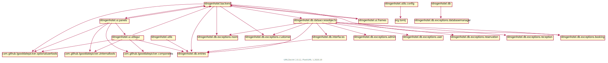
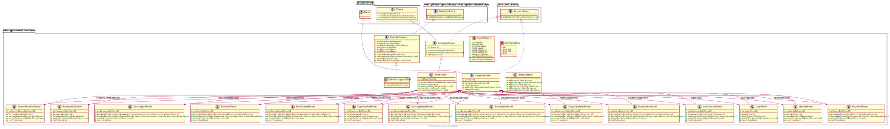
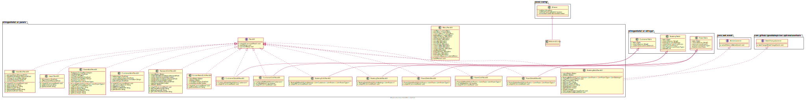
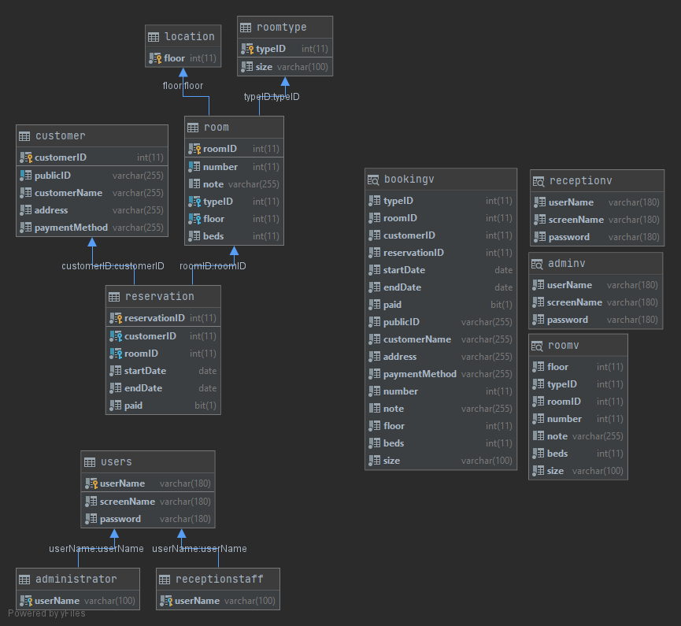
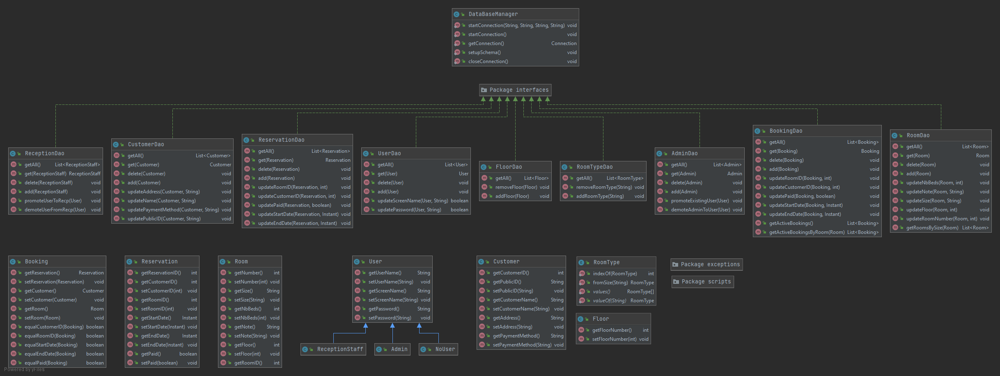
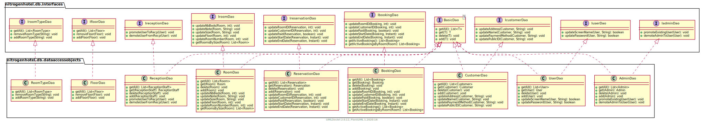
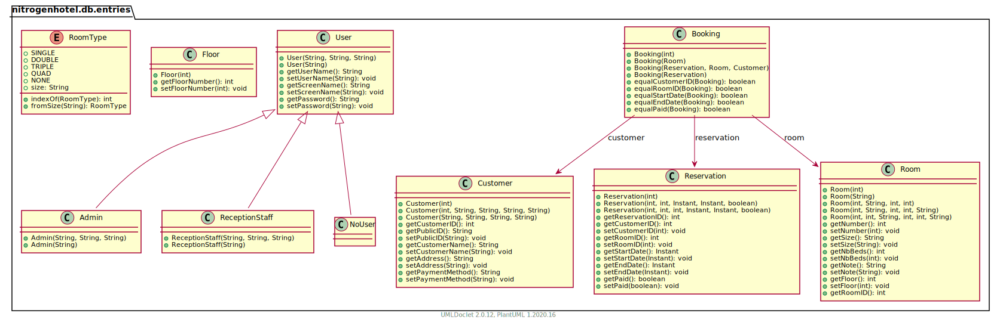

# Nitrogen Hotel

- [Demonstration video](#demonstration-video)
- [Contributing guidelines](#contributing-guidelines)
- [App Structure ](#app-structure )
- [App Overview](#app-overview)
- [App UMLs and diagrams](#app-umls-and-diagrams)
- [User Tests Cases](#user-test-cases)

## Demonstration video

[Video demonstration for the project](https://youtu.be/FTrZ3i0aXFA)

## Contributing guidelines

[Contribution guidelines for this project](CONTRIBUTING.md)

## App Structure 

- [Backend](./src/main/java/nitrogenhotel/backend)
- [Database](./src/main/java/nitrogenhotel/db)
- [Entries](./src/main/java/nitrogenhotel/entries)
- [User Interface](./src/main/java/nitrogenhotel/ui)
- [Utils](./src/main/java/nitrogenhotel/utils)

## App Overview

## App UMLs and diagrams

### Backend UML

### GUI Panels UML

### Database tables diagram

### Database diagram

### Database DAO UML

### Database Entries UML

## User Test Cases

[User (manual) test cases for this project](TESTCASES.md)